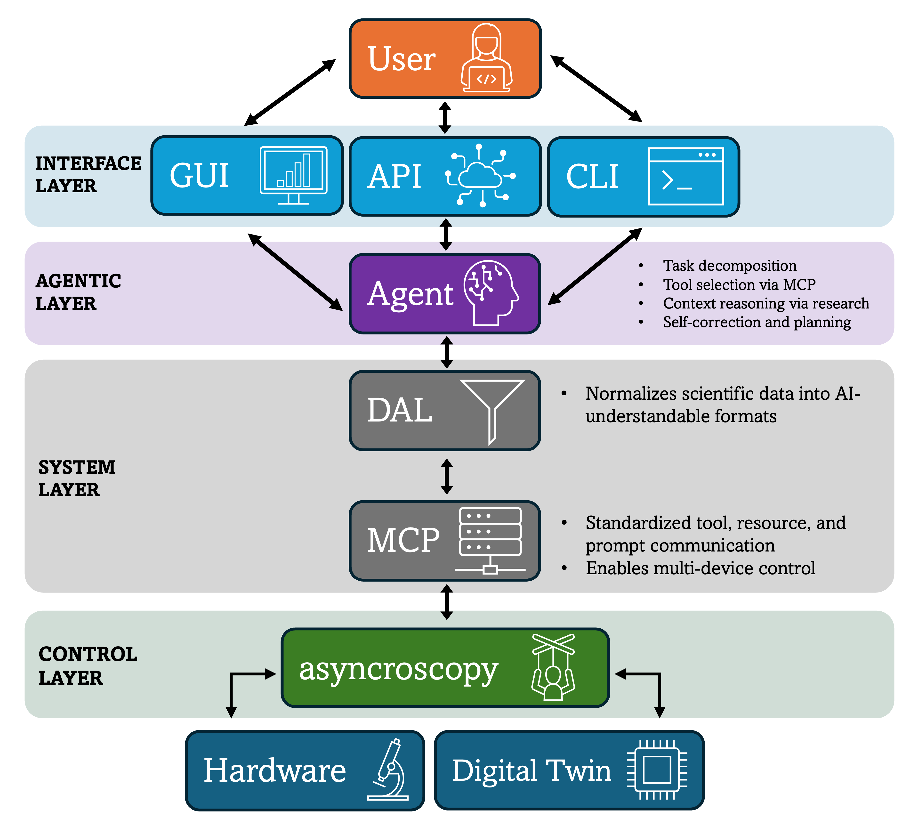
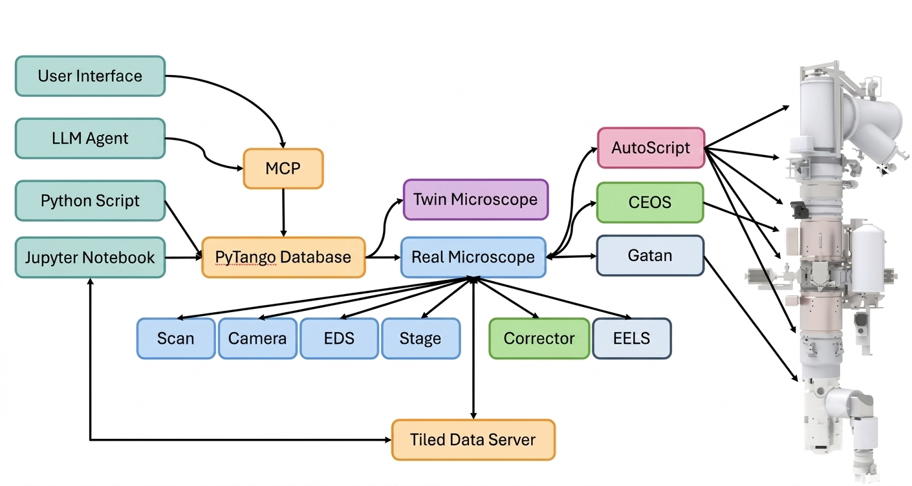

# Asyncroscopy

**Asynchronous control framework for smart microscopy.** Built on `PyTango` to be hardware-agnostic.

<div class="d-flex justify-content-between align-items-center w-100">
  
  
</div>

## Quick Start

```bash
# Install all dependencies
uv sync

# Start the server stack with a configuration
uv run startup_scripts/run_servers.py --yaml configs/Spectra300.yaml

# Or use the DigitalTwin (no hardware required)
uv run startup_scripts/run_servers.py --yaml configs/DigitalTwin.yaml
```

Start the MCP server in a second terminal for agent/AI integration:
```bash
uv run startup_scripts/run_mcp.py --yaml configs/mcp.yaml
```

For interactive GUI-based startup:
```bash
uv run startup_guis/server_gui.py
uv run startup_guis/mcp_gui.py
```

## Project Structure

```text
asyncroscopy/
├── data/              # Data management device
├── instruments/       # Hardware device implementations
└── mcp/               # FastMCP server for AI agents
```

## Configuration Files (`configs/`)

| Config | Purpose |
|--------|---------|
| `Spectra300.yaml` | Real Thermo Fisher Spectra 300 setup |
| `DigitalTwin.yaml` | Simulated microscope for development/testing |
| `diffraction.yaml` | DigitalTwin with diffraction simulation |
| `mcp.yaml` | MCP server configuration (not hardware) |

These are some examples of the available configs, which define the instrument class, supporting devices, Tango connection, and Tiled settings.

## Optional Dependencies

```bash
# Diffraction simulation (abTEM-based)
uv sync --extra diffraction

# AI agent support (LangChain/OpenAI)
uv sync --extra agent

# Local AI models via HuggingFace transformers (requires --extra agent)
uv sync --extra agent --extra localagent
```

## Running Tests

```bash
uv run pytest tests/ -v
```

## Architecture

- **Abstraction Layer:** Instruments are defined as abstract base classes, with specific implementations for different hardware. As such, models can be defined for various microscopes, digital twins, etc.
- **Device Orchestration:** Supporting devices (camera, EDS, stage, etc.) are initialized first and linked to the instrument via Tango properties.
- **Execution Order:** The instrument serves as the final integration point, instantiated only after all prerequisite supporting devices are running.
- **Data:** Data from devices is saved to Tiled.

## Documentation

Refer to the [asyncroscopy documentation](https://pycroscopy.github.io/asyncroscopy/).

## Notebooks

Various example workflows in `notebooks/`, including:

- `00_Testing.ipynb` - Connection tests
- `01_Aberrations.ipynb` - Probe aberration controls
- `02_Image_Acquisition.ipynb` - HAADF image acquisition
- `03_Stage_Movement_Sample_Map.ipynb` - Stage navigation
- `04_Image_EDS_Point_Spectra.ipynb` - EDS spectrum acquisition
- `05_Digital_Twin_EDS.ipynb` - DigitalTwin EDS simulation
- `06_Digital_Twin_Tilt.ipynb` - DigitalTwin tilt control
- `11_Test_AI_Agent.ipynb` - MCP agent testing

## Notes
* The previous Twisted-based implementation is preserved in the `twisted-legacy` branch for reference.