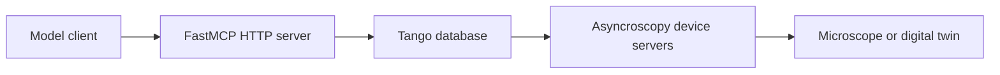

# Asyncroscopy MCP Implementation

The asyncroscopy MCP server lets local or remote model clients call live Tango
device commands through FastMCP.



## Runtime Contract

Start the Tango/device stack:

```bash
uv run startup_scripts/run_servers.py --yaml configs/Spectra300.yaml
```

Start MCP separately:

```bash
uv run startup_scripts/run_mcp.py --yaml configs/mcp.yaml
```

`configs/mcp.yaml` is the explicit MCP config. It contains the Tango endpoint,
the MCP HTTP endpoint, the DATA device address, and the command blocklist.

## What MCP Does At Startup

`MCPServer`:

1. Connects to the Tango database.
2. Lists exported devices.
3. Skips blocked Tango classes.
4. Queries each device's commands.
5. Skips blocked commands.
6. Registers the remaining commands as FastMCP tools.
7. Registers native helper tools such as `list_devices` and
   `get_data_from_key`.

There is no package search, source introspection requirement, or separate
Thermo-specific MCP class.

## Command Names

Tango commands are exposed as MCP tools using the device class and command name.
For example:

```text
SCAN.State
SCAN.Status
ThermoMicroscope.acquire_scanned_image
```

The exact tool set depends on which devices are exported in the Tango database
when MCP starts.

## Data Access

`get_data_from_key` is the required MCP-native data helper. It reads a DATA/Tiled
key for acquired HDF5 data and returns JSON-safe metadata plus a small preview.

Use this helper when a model needs to inspect acquisition results without
learning the full Tiled/HDF5 access pattern.

## Safety Boundary

MCP exposes hardware-control commands, so the YAML blocklist is part of the
runtime safety boundary. Keep destructive or server-management commands blocked:

```yaml
blocked_classes:
  - DataBase
  - DServer
blocked_functions:
  "*":
    - Init
    - Kill
    - RestartServer
```

Add project-specific exclusions before connecting an autonomous model client.
