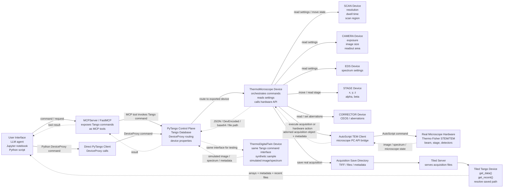

# Asyncroscopy Block Diagram

This diagram shows how a user command moves through Asyncroscopy to real microscope hardware, and how acquisition data returns to the user interface.

```mermaid
flowchart LR
    UI["User Interface<br/>LLM agent<br/>Jupyter notebook<br/>Python script"]

    MCP["MCPServer / FastMCP<br/>exposes Tango commands<br/>as MCP tools"]

    DIRECT["Direct PyTango Client<br/>DeviceProxy calls"]

    TANGO["PyTango Control Plane<br/>Tango Database<br/>DeviceProxy routing<br/>device properties"]

    MICRO["ThermoMicroscope Device<br/>orchestrates commands<br/>reads settings<br/>calls hardware API"]

    SCAN["SCAN Device<br/>resolution<br/>dwell time<br/>scan region"]
    CAM["CAMERA Device<br/>exposure<br/>image size<br/>readout area"]
    EDS["EDS Device<br/>spectrum settings"]
    STAGE["STAGE Device<br/>x, y, z<br/>alpha, beta"]
    CORR["CORRECTOR Device<br/>CEOS / aberrations"]

    AS["AutoScript TEM Client<br/>microscope PC API bridge"]

    HW["Real Microscope Hardware<br/>Thermo Fisher STEM/TEM<br/>beam, stage, detectors"]

    SAVE["Acquisition Save Directory<br/>TIFF / files / metadata"]

    TILED_SERVER["Tiled Server<br/>serves acquisition files"]

    TILED_DEV["Tiled Tango Device<br/>get_data()<br/>get_recent()<br/>resolve saved path"]

    TWIN["ThermoDigitalTwin Device<br/>same Tango command interface<br/>synthetic sample<br/>simulated image/spectrum"]

    UI -->|"command / request"| MCP
    UI -->|"Python DeviceProxy command"| DIRECT

    MCP -->|"MCP tool invokes Tango command"| TANGO
    DIRECT -->|"DeviceProxy command"| TANGO

    TANGO -->|"route to exported device"| MICRO
    TANGO -. "same interface for testing" .-> TWIN

    MICRO -->|"read settings / move state"| SCAN
    MICRO -->|"read settings"| CAM
    MICRO -->|"read settings"| EDS
    MICRO -->|"move / read stage"| STAGE
    MICRO -->|"read / set aberrations"| CORR

    MICRO -->|"execute acquisition or hardware action"| AS
    AS -->|"AutoScript command"| HW

    HW -. "image / spectrum / microscope state" .-> AS
    AS -. "adorned acquisition object + metadata" .-> MICRO

    MICRO -->|"save real acquisition"| SAVE
    SAVE --> TILED_SERVER
    TILED_SERVER --> TILED_DEV
    TILED_DEV -. "arrays + metadata + recent files" .-> UI

    MICRO -. "JSON / DevEncoded / base64 / file path" .-> TANGO
    TANGO -. "result" .-> MCP
    MCP -. "tool result" .-> UI

    TWIN -. "simulated image / spectrum / metadata" .-> TANGO
```
